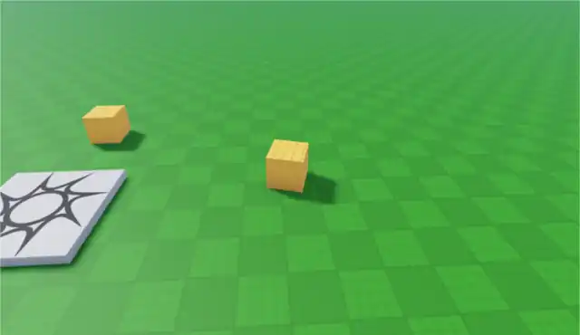
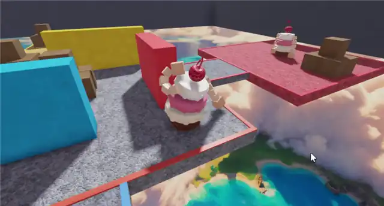

# Server-authoritative physics characters in Roblox

Link to place: [CakeMan On Roblox](https://www.roblox.com/games/101170476738993/Cakeman-Tutorial)

A mini article on building a custom physics character under Roblox **Server
Authority** (`Workspace.AuthorityMode = Server`) from an empty baseplate.

**Prior reading:** [Roblox Server Authority documentation](https://create.roblox.com/docs/projects/server-authority)

**[Chapter 1 — the method, built on a sliding cube](docs/01-the-method.md)**
The three-part method end to end: a server-owned character, client prediction, and a
presentation layer. Four files, about 200 lines, runnable. Start here.

This one doesn't use a Humanoid or a CharacterController - just straight parts and forces to get you started.



*Chapter 1 — two players, two server-owned cubes, full input prediction, resim, and visual smoothing.*

**[Chapter 2 — the cake with noodle arms](docs/02-building-cakeman.md)**
The natural extension of part 1 - The same four files, with the cube replaced by a floppy cake man made from ball sockets.
The netcode doesn't change; only the character does.



*Chapter 2 — the same four files, pointed at a stack of cake, plus some crates to knock over.*

**[The Server Authority reference](docs/reference/)**
Everything we know about building under SA, for any project rather than this one. Four files:
the [invariants and silent-failure tables](docs/reference/rules.md), the
[platform](docs/reference/server-authority.md), the
[patterns](docs/reference/patterns.md), and the
[physics-character doctrine](docs/reference/physics-characters.md). Written to be usable by
agents as well as people.

## Open a place and drive it

| Place | What's in it |
|---|---|
| [`samples/chapter1place/`](samples/chapter1place/) | Chapter 1 finished: the driveable cube, predicted and smoothed |
| [`samples/cakemanplace/`](samples/cakemanplace/) | Chapter 2 finished: CakeMan, the arena, and punching |

Download the `.rbxl`, open it in Studio, and press **Test → Server & Clients**. Both places
already have `Workspace.AuthorityMode = Server` set.

WASD drives. In the CakeMan place, walk into someone and swing — the arms do the rest.

## The scripts on their own

[`samples/cube/`](samples/cube/) — the finished Chapter 1 scripts, if you'd rather build up
from an empty baseplate than read a finished place. Drop them in at these paths:

| File | Goes to | Class |
|---|---|---|
| `CubeSim.luau` | `ReplicatedFirst` | ModuleScript |
| `CubePresent.luau` | `ReplicatedFirst` | ModuleScript |
| `CubeClient.local.luau` | `ReplicatedFirst` | LocalScript |
| `CubeServer.legacy.luau` | `ServerScriptService` | Script |

Then set `Workspace.AuthorityMode = Server` by hand in the Properties panel.

## Repo layout

```
docs/                    the article
  assets/                screenshots and clips, named for the step that uses them
  reference/             the Server Authority reference (applies to any SA project)
samples/
  chapter1place/         Chapter 1 finished, as a place file
  cakemanplace/          Chapter 2 finished, as a place file
  cube/                  Chapter 1's four scripts on their own
ReplicatedFirst/         the CakeMan source that Chapter 2 draws on
ServerScriptService/
ServerStorage/
```

Script suffixes are a file-sync convention: `.luau` is a ModuleScript, `.local.luau` a
LocalScript, `.legacy.luau` a Script.
