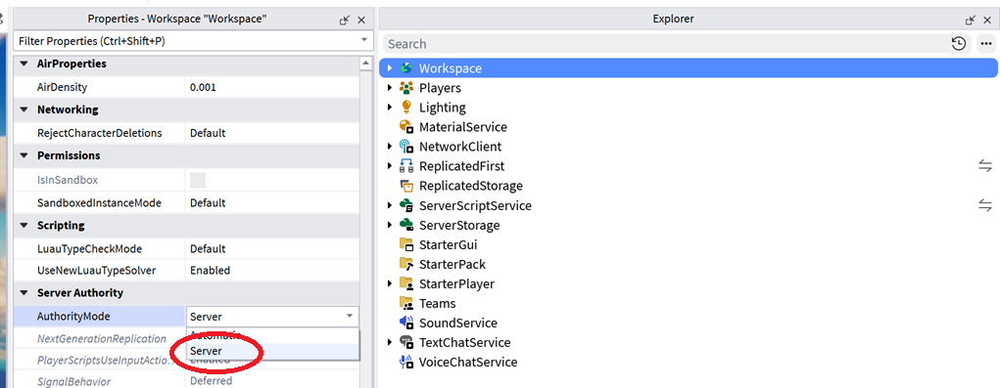
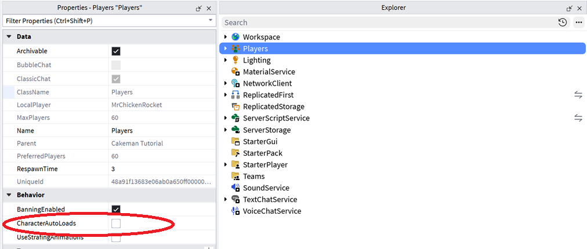

# 1. The method, built on a sliding cube

Server Authority moves character movement onto the server. The client no longer owns or
moves its character. It sends inputs; the server simulates; the result replicates back.

Two things follow: movement anticheat becomes secure by design. And designs where multiple
people interact with the same physics become something you can build a game out of, because
the server is simulating it for real and every client agrees on the result.

## The three parts

1. **A custom server character.** The server owns it and moves it.
2. **Client prediction.** Hides the input lag.
3. **A presentation layer.** Hides the corrections.

This chapter builds all three on a cube you shove around with a force every step. Four
files, about 200 lines. Chapter 2 keeps those same four files and swaps the cube for a
floppy cake with noodle arms.

**Prior reading:** the Roblox Server Authority documentation —
https://create.roblox.com/docs/projects/server-authority

## What you're building

```
ReplicatedFirst/
  CubeSim.luau            ModuleScript. The brain: runs on server AND client,
                          inside BindToSimulation.
  CubePresent.luau        ModuleScript. The visual layer (Part 3), plus the
                          critically-damped spring that drives it.
  CubeClient.local.luau   LocalScript. Client boot: the camera, the CameraDir feed.

ServerScriptService/
  CubeServer.legacy.luau  Script. Place settings, spawning, and the InputActions.
```

The suffixes are a file-sync convention: `.luau` is a ModuleScript, `.local.luau` a
LocalScript, `.legacy.luau` a Script. In Studio they're just the instance class.

Start from an empty baseplate and build it up as you read. To drive the finished thing
first, open [`samples/chapter1place/`](../samples/chapter1place/) and press
**Test → Server & Clients**.

---

## Part 1 — a custom server character

Under `Workspace.AuthorityMode = Server`, the server owns every character. Clients send
**inputs**; the server moves the characters from those inputs and replicates the result.

That round trip is input lag. Parts 2 and 3 are how it gets hidden.

### The checklist

1. Set `Workspace.AuthorityMode = Server`. This also enables streaming, which the
   replicator requires.
2. Set `Players.CharacterAutoLoads = false`. You are building your own character, so you
   spawn it.
3. On the server, create the Model that will be each player's character. Leave its parts
   **unanchored** and let the solver move them.
4. Set `player.Character` to that model.
5. Set `player.ReplicationFocus` to the model's root part.
6. Create the **InputAction** Instances that drive it — a movement vector, buttons —
   parented to the Player, so both machines can read them.
7. Apply those inputs to the character inside `BindToSimulation`, on the server.

> **Never anchor your character, and never write its velocity directly.** An anchored part
> is excluded from client prediction entirely — the owning client reports itself
> `Authoritative` for its own server-owned character and nothing is ever rolled back. There
> is no error and no warning. Hand the solver a force and let it do the moving.
>
> Verify with `RunService:GetPredictionStatus(root)`, which should return
> `Enum.PredictionStatus.Predicted`.

### Step 1 — Set the two place settings

Select `Workspace`. In Properties, set **AuthorityMode** to **Server**. Do this by hand;
it is place state, not something a script can set.



Then select `Players` and untick **CharacterAutoLoads**. You are building your own
character, so you spawn it.



`CubeServer` also sets `CharacterAutoLoads = false` in code, so the assumption is visible
in source control as well as in the place. Either alone is enough.

**Check:** reopen the place. `AuthorityMode` still reads `Server`.

### Step 2 — Spawn a cube per player

`ServerScriptService/CubeServer.legacy.luau`:

```lua
--!strict
local Players = game:GetService("Players")
local CollectionService = game:GetService("CollectionService")
local ReplicatedFirst = game:GetService("ReplicatedFirst")

Players.CharacterAutoLoads = false -- no Humanoids; the cube IS the character

local cubes = Instance.new("Folder")
cubes.Name = "Cubes"
cubes.Parent = workspace

local SPAWNS = {
	Vector3.new(0, 4, -16),
	Vector3.new(16, 4, 0),
	Vector3.new(0, 4, 16),
	Vector3.new(-16, 4, 0),
}
local spawnIndex = 0

local function buildInputContext(player: Player)
	if player:FindFirstChild("PlayContext") then
		return
	end

	local ctx = Instance.new("InputContext")
	ctx.Name = "PlayContext"
	ctx.Enabled = true

	local steer = Instance.new("InputAction")
	steer.Name = "Steer" -- the sim looks these up BY NAME
	steer.Type = Enum.InputActionType.Direction2D
	steer.Parent = ctx

	local kb = Instance.new("InputBinding")
	kb.Name = "Keyboard"
	kb.Up, kb.Down = Enum.KeyCode.W, Enum.KeyCode.S
	kb.Left, kb.Right = Enum.KeyCode.A, Enum.KeyCode.D
	kb.Parent = steer

	local pad = Instance.new("InputBinding")
	pad.Name = "Gamepad"
	pad.KeyCode = Enum.KeyCode.Thumbstick1
	pad.Parent = steer

	-- The camera direction rides in as an input too: the server has no camera, and a
	-- replayed step needs the direction AS IT WAS on that frame.
	local cameraDir = Instance.new("InputAction")
	cameraDir.Name = "CameraDir"
	cameraDir.Type = Enum.InputActionType.Direction3D
	cameraDir.Parent = ctx

	ctx.Parent = player -- parented to the Player, so BOTH machines can read it
end

local function spawnCubeFor(player: Player)
	buildInputContext(player)

	local name = "Cube_" .. player.UserId
	if cubes:FindFirstChild(name) then
		return
	end
	spawnIndex += 1

	local spawnAt = SPAWNS[((spawnIndex - 1) % #SPAWNS) + 1]

	local model = Instance.new("Model")
	model.Name = name

	local root = Instance.new("Part")
	root.Name = "Root"
	root.Size = Vector3.new(4, 4, 4)
	root.Color = Color3.fromRGB(220, 150, 60)
	root.Position = spawnAt
	root.Anchored = false
	root.CustomPhysicalProperties = PhysicalProperties.new(0.7, 0.1, 0.2, 1, 5)
	root.Parent = model
	model.PrimaryPart = root

	-- ACTUATORS ARE PRE-WIRED HERE, NOT IN THE SIM. The sim may not create instances (it
	-- re-runs on every replayed step), so everything it could ever need exists up front
	-- and the sim only writes TARGETS onto it.
	local att = Instance.new("Attachment")
	att.Name = "DriveAtt"
	att.Parent = root

	local thrust = Instance.new("VectorForce")
	thrust.Name = "Thrust"
	thrust.Attachment0 = att
	thrust.RelativeTo = Enum.ActuatorRelativeTo.World
	thrust.ApplyAtCenterOfMass = true
	thrust.Force = Vector3.zero
	thrust.Parent = root

	local heading = Instance.new("AlignOrientation")
	heading.Name = "Heading"
	heading.Mode = Enum.OrientationAlignmentMode.OneAttachment
	heading.Attachment0 = att
	heading.MaxTorque = 1e6
	heading.Responsiveness = 40
	heading.CFrame = CFrame.identity
	heading.Parent = root

	-- Intent lives in attributes, because attributes roll back with resimulation.
	root:SetAttribute("MoveDir", Vector3.zero)
	root:SetAttribute("FaceDir", Vector3.new(0, 0, -1))

	-- Part 3 renders a smoothed copy of anything with this tag.
	CollectionService:AddTag(root, "Presented")

	-- An instance the client was never sent cannot be predicted.
	model.ModelStreamingMode = Enum.ModelStreamingMode.Persistent
	model.Parent = cubes

	-- THE TWO LINES EVERYONE FORGETS. Neither is discoverable.
	player.ReplicationFocus = root -- what replication and PREDICTION centre on
	player.Character = model -- what the camera knows not to push through

	print("[CubeServer] spawned", name)
end

Players.PlayerAdded:Connect(spawnCubeFor)
Players.PlayerRemoving:Connect(function(player)
	local model = cubes:FindFirstChild("Cube_" .. player.UserId)
	if model then
		model:Destroy()
	end
end)
for _, p in Players:GetPlayers() do
	spawnCubeFor(p)
end

require(ReplicatedFirst:WaitForChild("CubeSim")).Initialize()
print("[CubeServer] ready")
```

Two lines there do more than they look like they do.

**`player.ReplicationFocus`** is what the server replicates around, and what prediction is
centred on. Without it, your own cube isn't predicted and every input feels like a full
round trip.

**`player.Character`** is what the camera knows not to push through. With no Humanoid,
nothing sets it, and the stock camera treats your character as scenery.

**Check:** press Play. A cube appears and no stock avatar does.

### Step 3 — Write the brain

`ReplicatedFirst/CubeSim.luau`. This is the only file bound to the simulation, and it runs
on **both** machines.

```lua
--!strict
local RunService = game:GetService("RunService")
local Players = game:GetService("Players")

local CubeSim = {}

local TARGET_SPEED = 24 -- studs/s the servo holds. A CAP, not a motor -- see drive().
local ACCEL_GAIN = 8 -- servo stiffness: higher = snappier to target, lower = heavier
local COAST_DRAG = 2 -- gentle damping when not driving: it coasts to a stop
local TURN_RATE = math.rad(540) -- how fast the FACING catches up. Movement never waits.
local UP = Vector3.new(0, 1, 0)

-- Rotate unit `cur` toward unit `tgt` by at most `maxRad` (shortest arc).
local function slewDir(cur: Vector3, tgt: Vector3, maxRad: number): Vector3
	local d = math.clamp(cur:Dot(tgt), -1, 1)
	local ang = math.acos(d)
	if ang < 1e-4 then
		return tgt
	end
	local axis = cur:Cross(tgt)
	if axis.Magnitude < 1e-5 then
		return tgt
	end
	return CFrame.fromAxisAngle(axis.Unit, math.min(maxRad, ang)):VectorToWorldSpace(cur)
end

local function readAction(player: Player, name: string): any
	local ctx = player:FindFirstChild("PlayContext")
	local action = ctx and ctx:FindFirstChild(name)
	return action and (action :: any):GetState() or nil
end

-- OWNER: live input -> intent.
local function readInput(root: BasePart, player: Player)
	local steer = readAction(player, "Steer") or Vector2.zero
	if steer.Magnitude < 0.1 then
		root:SetAttribute("MoveDir", Vector3.zero)
		return
	end

	-- Camera-relative steering, recomputed EVERY frame: hold W and swing the camera
	-- to carve a curve.
	local camF = readAction(player, "CameraDir") or Vector3.zero
	local fwd = camF - UP * camF.Y -- flatten onto the ground plane
	if fwd.Magnitude < 1e-3 then
		return
	end
	fwd = fwd.Unit
	local right = fwd:Cross(UP)
	local move = fwd * steer.Y + right * steer.X
	root:SetAttribute("MoveDir", if move.Magnitude > 1e-3 then move.Unit else Vector3.zero)
end

-- EVERY PEER: drive the ACTUATORS from the (owner-written) attributes. The physics
-- solver does the moving; we only ever hand it a target.
local function drive(root: BasePart, dt: number)
	local thrust = root:FindFirstChild("Thrust") :: VectorForce?
	local heading = root:FindFirstChild("Heading") :: AlignOrientation?
	if not thrust or not heading then
		return
	end

	local dir = (root:GetAttribute("MoveDir") :: Vector3?) or Vector3.zero
	local driving = dir.Magnitude > 1e-3

	-- Servo the HORIZONTAL velocity only. Gravity owns vertical.
	local vFlat = root.AssemblyLinearVelocity
	vFlat -= UP * vFlat.Y

	-- THE VELOCITY SERVO, and it is one line.
	--
	-- The gap term closes toward TARGET_SPEED and GOES NEGATIVE above it, which is what
	-- makes this a CAP rather than a motor: it cannot run away. Multiplied by mass at the
	-- last moment, so the knobs stay in acceleration units.
	local mass = root.AssemblyMass
	if driving then
		thrust.Force = (dir * TARGET_SPEED - vFlat) * (ACCEL_GAIN * mass)
		root:SetAttribute(
			"FaceDir",
			slewDir(((root:GetAttribute("FaceDir") :: Vector3?) or dir).Unit, dir, TURN_RATE * dt)
		)
	else
		thrust.Force = -vFlat * (COAST_DRAG * mass) -- coast to rest, no hard brake
	end

	-- The body carves immediately; the nose catches up afterwards.
	local face = (root:GetAttribute("FaceDir") :: Vector3?) or Vector3.new(0, 0, -1)
	if face.Magnitude > 1e-3 then
		heading.CFrame = CFrame.lookAt(Vector3.zero, face, UP)
	end
end

function CubeSim.Initialize()
	local isServer = RunService:IsServer()
	local localPlayer = Players.LocalPlayer -- nil on the server

	-- Hz60, NOT the default. BindToSimulation defaults to Enum.StepFrequency.Hz30 while
	-- the physics world runs at 60, so at the default the servo corrects half as often as
	-- the world it is correcting against.
	RunService:BindToSimulation(function(dt: number)
		local cubes = workspace:FindFirstChild("Cubes")
		if not cubes then
			return
		end
		for _, player in Players:GetPlayers() do
			local model = cubes:FindFirstChild("Cube_" .. player.UserId)
			local root = model and model:IsA("Model") and model.PrimaryPart
			if root then
				-- The server owns every cube. A client owns only its own.
				if isServer or player == localPlayer then
					readInput(root, player)
				end
				drive(root, dt)
			end
		end
	end, Enum.StepFrequency.Hz60)
end

return CubeSim
```

Set `.Name` on every InputAction — the sim finds them with `ctx:FindFirstChild("Steer")`,
so an unnamed action is invisible and the cube won't move.

**Use InputActions, not RemoteEvents.** InputActions replicate *and roll back*. A
RemoteEvent has no shared timeline, so the server and your client's rollback can't agree on
when you pressed the key.

The bind rate is an optional second argument, and it takes an enum:

```lua
RunService:BindToSimulation(fn, Enum.StepFrequency.Hz60)
-- Hz60 | Hz30 (default) | Hz15 | Hz10 | Hz5 | Hz1
```

### Step 4 — Build a camera, and feed its direction in as input

Server Authority gives you no `PlayerModule` in a characterless place, so `CameraType =
Custom` does nothing and the camera sits near the origin. You build it.

`ReplicatedFirst/CubeClient.local.luau`:

```lua
--!strict
local Players = game:GetService("Players")
local RunService = game:GetService("RunService")
local UserInputService = game:GetService("UserInputService")
local ReplicatedFirst = game:GetService("ReplicatedFirst")

if not game:IsLoaded() then
	game.Loaded:Wait()
end
local player = Players.LocalPlayer

local CubePresent = require(ReplicatedFirst:WaitForChild("CubePresent"))
CubePresent.Initialize()
require(ReplicatedFirst:WaitForChild("CubeSim")).Initialize() -- the SAME brain, client side

local camera = workspace.CurrentCamera
camera.CameraType = Enum.CameraType.Scriptable -- without this, your CFrame is overwritten

local CAM_HEIGHT = 6
local CAM_SMOOTH = 0.12 -- follow lag (s)
local CAM_SENS = 0.006 -- mouse radians per pixel
local PITCH_MIN, PITCH_MAX = math.rad(-70), math.rad(35)
local ZOOM_MIN, ZOOM_MAX = 12, 80

local yaw, pitch, zoom = 0, math.rad(-18), 34
local focus: Vector3? = nil
local focusVel = Vector3.zero
local orbiting = false

UserInputService.InputBegan:Connect(function(input: InputObject, processed: boolean)
	if not processed and input.UserInputType == Enum.UserInputType.MouseButton2 then
		orbiting = true
		UserInputService.MouseBehavior = Enum.MouseBehavior.LockCurrentPosition
	end
end)
UserInputService.InputEnded:Connect(function(input: InputObject)
	if input.UserInputType == Enum.UserInputType.MouseButton2 then
		orbiting = false
		UserInputService.MouseBehavior = Enum.MouseBehavior.Default
	end
end)
UserInputService.InputChanged:Connect(function(input: InputObject, processed: boolean)
	if processed then
		return
	end
	if input.UserInputType == Enum.UserInputType.MouseMovement and orbiting then
		yaw -= input.Delta.X * CAM_SENS
		pitch = math.clamp(pitch - input.Delta.Y * CAM_SENS, PITCH_MIN, PITCH_MAX)
	elseif input.UserInputType == Enum.UserInputType.MouseWheel then
		zoom = math.clamp(zoom - input.Position.Z * 4, ZOOM_MIN, ZOOM_MAX)
	end
end)

local function myRoot(): BasePart?
	local cubes = workspace:FindFirstChild("Cubes")
	local model = cubes and cubes:FindFirstChild("Cube_" .. player.UserId)
	return model and (model :: Model).PrimaryPart or nil
end

RunService:BindToRenderStep("CubeCamera", Enum.RenderPriority.Camera.Value, function(dt: number)
	local root = myRoot()
	if not root then
		return
	end

	-- Follow the SMOOTHED copy. The truth is the thing that snaps on a correction, and a
	-- camera pointed at it turns every correction into a flick of the whole screen.
	local follow = CubePresent.GetSmoothed(root) or root
	local target = follow.Position + Vector3.new(0, CAM_HEIGHT, 0)
	if not focus then
		focus = target -- snap on frame 1, or it sails in from the world origin
	end
	focus, focusVel = CubePresent.damp(focus :: Vector3, target, focusVel, CAM_SMOOTH, math.min(dt, 0.05))

	local dir = CFrame.fromEulerAnglesYXZ(pitch, yaw, 0)
	local eye = (focus :: Vector3) + dir:VectorToWorldSpace(Vector3.new(0, 0, zoom))
	camera.CFrame = CFrame.lookAt(eye, focus :: Vector3)
end)

-- FEED THE CAMERA DIRECTION IN AS AN INPUT.
--
-- The simulation cannot read workspace.CurrentCamera: the server hasn't got one, and a
-- replayed step needs the direction AS IT WAS on that frame. So it arrives like any other
-- input -- fire on change, plus a slow keep-alive.
local playContext = player:WaitForChild("PlayContext")
local cameraDir = playContext:WaitForChild("CameraDir")
local lastFired = Vector3.zero
local sinceFire = 0
RunService.RenderStepped:Connect(function(dt: number)
	local dir = camera.CFrame.LookVector
	sinceFire += dt
	if (dir - lastFired).Magnitude > 0.02 or sinceFire > 0.5 then
		cameraDir:Fire(dir)
		lastFired = dir
		sinceFire = 0
	end
end)
```

`camera.CameraType = Enum.CameraType.Scriptable` is load-bearing. Without it, something
else writes `camera.CFrame` after you do and your camera silently does nothing.

That file requires `CubePresent`, which you write in Part 3. To test Part 1 on its own,
comment out the two `CubePresent` lines and use `root` directly as the camera's `follow`.

**Check — the Part 1 milestone.** Run **Test → Server & Clients**. Press W. The cube moves,
for everyone, in the direction you're facing — after a delay you can feel. That delay is
what Part 2 removes.

---

## Part 2 — client prediction

Any input has to make a round trip — client → server → back to every client — before you
see the effect.

Inputs the server has already processed show up as changes to the character. Inputs you've
fired that it hasn't confirmed yet are **in flight**, and those are what make
**resimulation** possible.

When a fresh authoritative view arrives from the server, the client:

1. Snaps the world back to the new authoritative server state.
2. Replays your `BindToSimulation` step once for every still-unconfirmed input frame,
   fast-forwarding to the present.

It lands back in the present, starting from the server's truth, with all your newer input
applied. That is what removes the input latency.

It rests on one requirement: **given the same starting state, the same inputs, and the same
amount of time, your simulation must produce the same result.**

### Step 5 — Run the same brain on the client

There is no "predict me" switch. You have already done the work, in three places:

- `CubeSim` is a module, and **`CubeClient` requires and initialises the same file**
  (Step 4). One brain, two machines.
- Intent lives in **attributes**, which roll back with resimulation.
- `ReplicationFocus` and `player.Character` are set (Step 2), which gives the engine a
  centre to predict from.

**Check:** press W under Server & Clients. The cube moves *immediately*, and a second client
still sees it in the right place.

### The rules that keep it deterministic

Your movement code re-runs on every resimulation, often more than it runs live. So inside
`BindToSimulation`:

1. **Read time from `dt` or the global `time()`, and nothing else.** `os.time`, `tick`,
   `os.clock` and `DistributedGameTime` are wall clocks — they keep ticking through a
   replay and stop agreeing with `dt`. `time()` rolls back with resimulation, so inside a
   replayed step it reports the simulated frame's time.
2. **No randomness**, unless the seed rolls back too.
3. **No side effects on a replayed step.** Don't play a sound or spawn a particle — it
   already happened the first time. Fire effects from render code off state *transitions*,
   or guard them with `RunService:IsResimulating()`.
4. **No instance creation** without reading the section on Instance Stitching in the Server
   Authority docs.

---

## Part 3 — a presentation layer

The physics and instance positions of server-owned instances are the **truth**. They have
no consideration for visual fluidity, but they are correct — and when a prediction misses,
they snap.

So hide the authoritative version on the client, show a second copy created entirely on the
client, and use critically damped springs to ease that copy toward the truth.

### Step 6 — Build the visual layer

`ReplicatedFirst/CubePresent.luau`:

```lua
--!strict
local RunService = game:GetService("RunService")
local CollectionService = game:GetService("CollectionService")

local CubePresent = {}

local SMOOTH_TIME = 0.06 -- position follow (s). Higher = smoother, and laggier.
local ROT_TIME = 0.07 -- rotation follow (s). A hair slower reads as weight.
local LEAD = 0.05 -- aim ahead of the truth, or the copy trails on a rubber band
local SNAP_DIST = 24 -- past this, teleport. Smoothing a teleport looks like a bug.
local DT_CLAMP = 0.05 -- one hitched frame must not fling the copy across the room

-- Critically-damped spring toward `tgt`. `st` is roughly the time to arrive.
-- Returns (newPos, newVel); thread `vel` back in on the next call.
function CubePresent.damp(cur: Vector3, tgt: Vector3, vel: Vector3, st: number, dt: number): (Vector3, Vector3)
	st = math.max(st, 1e-4)
	local omega = 2 / st
	local e = math.exp(-omega * dt)
	local change = cur - tgt
	local temp = (vel + change * omega) * dt
	return tgt + (change + temp) * e, (vel - temp * omega) * e
end

type Follow = {
	truth: BasePart,
	copy: BasePart,
	pos: Vector3, -- the smoothed position we render at
	vel: Vector3, -- spring velocity, threaded back into damp()
}

local follows: { [BasePart]: Follow } = {}
local folder: Folder? = nil

local function visualsFolder(): Folder
	if folder and folder.Parent then
		return folder :: Folder
	end
	local f = Instance.new("Folder")
	f.Name = "Presentation"
	f.Parent = workspace
	folder = f
	return f
end

local function adopt(truth: BasePart)
	if follows[truth] then
		return
	end

	local copy = truth:Clone()

	-- A VISUAL COPY IS STILL A PART, AND A CLONE INHERITS EVERYTHING.
	--
	-- Left alone it will collide, answer raycasts, fire Touched, take part in fluid
	-- forces, occlude audio, and carry every tag and attribute the original had. All of
	-- that is invisible to you and visible to your game. Neutralise the lot.
	--
	-- The tags matter most: the copy would arrive already tagged "Presented", we would
	-- present IT, that copy would arrive tagged too, and the layer eats itself.
	for _, tag in CollectionService:GetTags(copy) do
		CollectionService:RemoveTag(copy, tag)
	end
	for name in copy:GetAttributes() do
		copy:SetAttribute(name, nil)
	end

	copy.Anchored = true
	copy.CanCollide = false
	copy.CanQuery = false -- raycasts. See the note below -- this one is the expensive miss.
	copy.CanTouch = false
	copy.AudioCanCollide = false
	copy.EnableFluidForces = false
	copy.Massless = true
	copy.CFrame = truth.CFrame
	copy.Name = truth.Name .. "_Visual"
	copy.Parent = visualsFolder()

	-- Hide the truth, on THIS CLIENT ONLY. LocalTransparencyModifier is client-side: the
	-- server's copy is untouched and nobody else's view changes.
	truth.LocalTransparencyModifier = 1

	follows[truth] = {
		truth = truth,
		copy = copy,
		pos = truth.Position,
		vel = Vector3.zero,
	}
end

local function abandon(truth: BasePart)
	local f = follows[truth]
	if not f then
		return
	end
	f.copy:Destroy()
	if f.truth.Parent then
		f.truth.LocalTransparencyModifier = 0
	end
	follows[truth] = nil
end

function CubePresent.Initialize()
	-- The entire subscription. One tag in, visual copies out. This file knows nothing
	-- about cubes; it knows about a tag.
	local function consider(inst: Instance)
		if inst:IsA("BasePart") then
			adopt(inst :: BasePart)
		end
	end

	for _, inst in CollectionService:GetTagged("Presented") do
		consider(inst)
	end
	CollectionService:GetInstanceAddedSignal("Presented"):Connect(consider)
	CollectionService:GetInstanceRemovedSignal("Presented"):Connect(function(inst)
		if inst:IsA("BasePart") then
			abandon(inst :: BasePart)
		end
	end)

	RunService.RenderStepped:Connect(function(dt: number)
		dt = math.min(dt, DT_CLAMP)
		local rotAlpha = 1 - math.exp(-dt / ROT_TIME)

		for truth, f in follows do
			if not truth.Parent then
				abandon(truth)
				continue
			end

			-- The cube is moved by the physics solver, so it just tells us how fast it is
			-- going. Nothing to reconstruct.
			local target = truth.Position + truth.AssemblyLinearVelocity * LEAD

			if (target - f.pos).Magnitude > SNAP_DIST then
				f.pos, f.vel = truth.Position, Vector3.zero -- teleport: don't "smooth" it
			else
				f.pos, f.vel = CubePresent.damp(f.pos, target, f.vel, SMOOTH_TIME, dt)
			end

			f.copy.CFrame = CFrame.new(f.pos) * f.copy.CFrame.Rotation:Lerp(truth.CFrame.Rotation, rotAlpha)
		end
	end)
end

-- The camera should follow the SMOOTHED copy. Tracking the truth means tracking a thing
-- that snaps.
function CubePresent.GetSmoothed(truth: BasePart): BasePart?
	local f = follows[truth]
	return f and f.copy or nil
end

return CubePresent
```

Three details in the render step are load-bearing: the **velocity lead**, so smoothing
doesn't leave moving objects trailing; the **snap distance**, so a teleport isn't smoothed
across the map; and the **clamped `dt`**, so one hitched frame doesn't fling the copy away.

### Step 7 — Hide your presentation parts from the rest of the game

**Your visual copy is still a Part**, and it arrived as a clone, so it inherited
everything. A part is a loud object in Roblox: by default it collides, answers raycasts,
fires `Touched`, occludes audio, takes part in fluid forces, and carries every tag and
attribute the original had.

None of that is visible to you. All of it is visible to your game. So blast it flat:

```lua
copy.CanCollide = false
copy.CanQuery = false
copy.CanTouch = false
copy.AudioCanCollide = false
copy.EnableFluidForces = false
copy.Massless = true
-- ...and strip every tag and attribute it inherited
```

`CanQuery` is the one that actually costs you. Your anchored copy is visible to your own
raycasts on the client only — geometry the server does not have — so your client starts
simulating a world the server disagrees with, which is a misprediction you built by hand.

The general habit is worth more than the list: **presentation parts are parts, so hide them
from your datamodel as thoroughly as you can.** Park them in their own folder, strip what
they inherited, and turn off every system they have no business being in.

**Check:** raycast down from your cube with the default filter. It hits the floor, not a
visual copy.

### Step 8 — Confirm the layer is doing something

Overlay the truth in red, semi-transparent, over the polished copy:

```lua
truth.LocalTransparencyModifier = 0.45
truth.Color = Color3.fromRGB(235, 70, 70)
copy.LocalTransparencyModifier = 0.35
```

**Check — the Part 3 milestone.** With the overlay on, the red truth steps and snaps while
the visible cube glides through it.

Tag only **things the physics moves**. Anchored scenery must not be tagged, or you pay to
lerp a wall toward itself sixty times a second.

---

## What you have now

A cube that is server-owned, uncheatable, instantly responsive, and smooth — in four files
and about 200 lines. You can drive the finished place from [`samples/chapter1place/`](../samples/chapter1place/).

| | |
|---|---|
| **Part 1** | Server spawns it, owns it, and hands the solver a force inside `BindToSimulation`. Input arrives as InputActions. |
| **Part 2** | The same brain runs on the client. Intent lives in attributes, so it rolls back and replays. |
| **Part 3** | The truth is hidden and a smoothed client-only copy is shown, with `CanQuery = false`. |

The netcode is finished, and it does not care what your character is. Chapter 2 changes the
character and touches none of the above.

---

**Next:** [Chapter 2 — the cake with noodle arms](02-building-cakeman.md).
