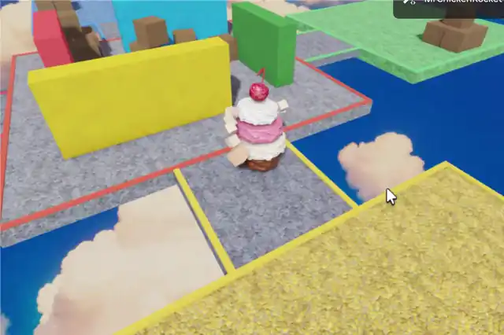
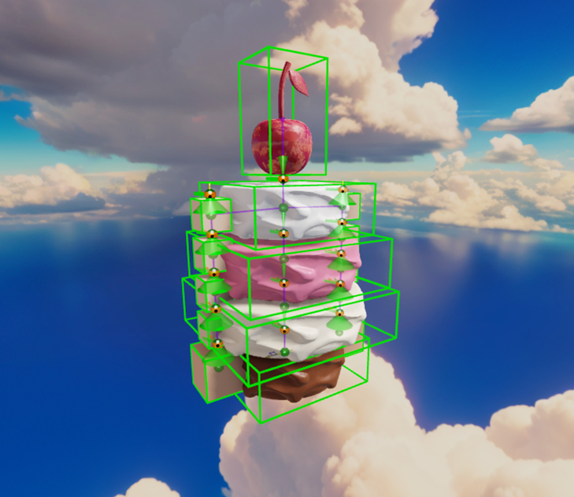

# 2. The cake with noodle arms

Chapter 1 built a cube that is server-owned, predicted and smooth. This chapter replaces
the cube with **CakeMan**: four cake layers stacked on ball sockets, a glacé cherry for a
head, and two five-segment arms ending in heavy fists. All of his animation is entirely physics,
and he demands violence.



To drive him first, open [`samples/cakemanplace/`](../samples/cakemanplace/) and press
**Test → Server & Clients**.

Pay special note to spinning him to flail his arms around and knocking some boxes over. Server authority means everyone is seeing the same thing you are, and it will all interact exactly as you'd hope it would.

## What changes, and what doesn't

| File from Chapter 1 | What happens to it |
|---|---|
| `CubePresent` → `Presentation` | **Nothing.** It presents anything tagged `Presented`. A cake is 15 tagged parts instead of 1. |
| `CubeClient` → `CakeClient` | **Nothing structural.** Same camera, same `CameraDir` feed. |
| `CubeServer` → `CakeServer` | Spawns by **cloning a rig** instead of building a Part. |
| `CubeSim` → `CakeSim` | Same velocity servo, now hauling a whole stack. It gains a hop and a slewed facing. |

The cube already handed a force to the solver every step, so this chapter changes no
technique — it changes the body the technique is pointed at. One file is genuinely new, and
it arrives at the end: `CakePunch`.

## The thesis: the ragdoll is the character

There is a tempting way to build a character like this: simulate a tidy invisible capsule,
then hang a wobbly puppet off it for show. The result *looks* physical and isn't. It can't
be knocked over, its arms can't catch on anything, and every collision has to be faked.

Server Authority lets us do the opposite: Just use the raw physics engine and server authority and let the solver work it out.

Our cake man is quite literally just a stack of unanchored parts with ball sockets holding it all together and some vector forces to make him move about.

---

## Part 1 — build the rig

The rig is a real Model saved in the place: `ServerStorage.CakeManRig`. Spawning the
CakeMan character in is just a matter of cloning him on the server — same as last chapter's
box, but a clone instead of `Instance.new()`.

After that it's assorted tuning and cleanup code to get the rig exactly how we want it.



That is the whole character: four cake layers and a cherry, each its own part, with a ball
socket at every seam. The green boxes are the parts; the gizmos on the joints are the cones
they are allowed to move inside.

**Take the rig from the sample place rather than building your own.** It is a stack of
unanchored parts held together by ball sockets, and getting one of those right is a chapter
in itself — two of the mistakes fail silently, with no error and no warning:

- An `Attachment` must be **parented before you position it**, or `WorldCFrame` is
  discarded, every joint lands at its part's origin, and the character collapses into a
  heap the moment it spawns.
- A `BallSocketConstraint` measures its cone around the attachment's **X axis**. Build the
  attachment with `CFrame.new(pos)` and X points along world +X, so a limb chaining along Y
  bends on its twist axis and twists on its bend axis.

If you do build your own, turn the joint gizmos on and look at them — as in the shot above.
Both of those mistakes are invisible in code and obvious in a picture. The recipe that
produced this rig is in
[`ServerStorage/GenerateRig.legacy.luau`](../ServerStorage/GenerateRig.legacy.luau).

---

## Part 2 — replace the brain's drive step

`CakeSim` keeps the exact shape of `CubeSim` — owner reads input into attributes, every
peer drives actuators from those attributes — and obeys the same four rules. Only `drive()`
changes.

### Add the hop, on a distance clock

He has no legs, so he bounces. One clock and one force:

```lua
-- owner, each step: advance the clock by DISTANCE TRAVELLED, but never slower than
-- HOP_MIN_SPEED while he is actually driving
local speed = (v - UP * v.Y).Magnitude
if driving then
	speed = math.max(speed, HOP_MIN_SPEED)
end
base:SetAttribute("HopPhase", (hop + speed * dt / HOP_STRIDE) % 1)

-- every peer: push off during the early slice of each cycle, if he's on the ground
if driving and hopPhase < HOP_WINDOW and math.abs(vy) < HOP_GROUNDED_VY then
	force += UP * (HOP_ACCEL * mass)
end
```

**The clock advances by distance travelled.** It resimulates identically, and the cadence
tracks his speed for free — slow down and he hops slower, with no extra code.

**The grounded check is required.** Without it he boosts himself in mid-air every cycle and
floats away.

**Put a floor under the clock while driving.** A pure distance clock stops dead the moment
he's blocked, so shoved against a wall he stands there silent and still while the player is
mashing a key. Gate the floor on `driving`, not on speed, so releasing the key still stops
him.

The free part: the base hops, and everything above it is dragged into the air a beat later
through the joints. The cake squashes on the way up and the cherry keeps going after he
lands.

###  Split facing from movement

Movement uses the target direction immediately. The facing slews toward it separately:

```lua
base:SetAttribute("DriveDir", slewDir(cur, tdir, TURN_RATE * dt))
```

You strafe the moment you press the key; the cake swings around afterwards. That split is
most of what makes him feel like a heavy object with flaily arms.

Crank `TURN_RATE` up and the arms, which obey nothing but physics, get flung out sideways.

**A fast turn rate doesn't work if you have a slow actuator.** The `AlignOrientation` that
applies the rotation becomes the speed limit, so both numbers have to be quick.

---

## Part 3 — punching

There is no attack button and no attack animation. The arms already have mass, and a fast
turn already whips them out to arm's length, so a punch is a fist that arrived somewhere
fast. The only question is how fast.

### Put it on the server, outside the simulation

`CakeSim` is the movement brain. It runs on both machines and re-runs during
reconciliation, so it may only read input and write actuator targets.

A punch is a **consequence**: the server watches a collision and decides that one man's
fist arrived at another. Movement is predicted; consequences are authoritative. That is why
`CakePunch` is a separate server script.

### Cache the pre-impact velocity

`Touched` fires *after* the solver resolved the contact, so the velocity you read there is
what's left over — for a light thing hitting a heavy thing, nearly nothing.

Keep last frame's velocity yourself:

```lua
-- Heartbeat runs AFTER physics, so what we store is the velocity each part carried INTO
-- the next step -- which is the pre-impact one. Weak keys, so destroyed parts drop out.
local prevVel: { [BasePart]: Vector3 } = setmetatable({}, { __mode = "k" }) :: any

RunService.Heartbeat:Connect(function()
	for _, man in menFolder:GetChildren() do
		for _, p in (man :: Model):GetDescendants() do
			if p:IsA("BasePart") then
				prevVel[p :: BasePart] = (p :: BasePart).AssemblyLinearVelocity
			end
		end
	end
end)

local function approachVel(part: BasePart): Vector3
	return prevVel[part] or part.AssemblyLinearVelocity
end
```

Without this, every clean hit registers as a tap.

### Apply the shove

```lua
local relSpeed = (approachVel(other) - approachVel(victimPart)).Magnitude
if relSpeed < HIT_SPEED_MIN then return end

-- Renormalised: the lift changes the DIRECTION of the shove, not its size.
local push = (otherVel.Unit + Vector3.yAxis * KNOCKBACK_LIFT).Unit
victim.PrimaryPart:ApplyImpulse(push * (relSpeed - HIT_SPEED_MIN) * KNOCKBACK)
attacker.PrimaryPart:ApplyImpulse(-push * (relSpeed - HIT_SPEED_MIN) * KNOCKBACK * KNOCKBACK_REACTION)
```

Relative speed is the right measure for two fighters: it's the same number whether you
swung into someone or they ran onto your fist.

The impulse goes on the **root**, so the man skids while the cake above him lags and flails
behind. The wobble does the knockback animation for you.

Bias the shove upward so a hit lifts as well as slides, and push the attacker back by a
fraction so the punch rocks both men.

**Key the hit cooldown to the victim, not the part you clipped.** A cake is five slabs, so
a fist sweeping through a man catches his sponge, his strawberry and his icing on the way
past and bills him separately for each.

**Only fists punch:**

```lua
if not string.match(other.Name, "^Arm[LR]5$") then return end
```

Without it, barging someone with your body launches them and the game becomes about walking
into people.

---

## The important bit

Punching is only calculated on the server. This causes mispredictions, but this is a case of good misprediction and is just the cost of doing business with server authority.


## Conclusion

You now have a wobbly cake man. Expanding it further you could do the presentation any way you like - eg: pose bones of a skinned mesh where the parts are...

Maybe that can be chapter 3!
